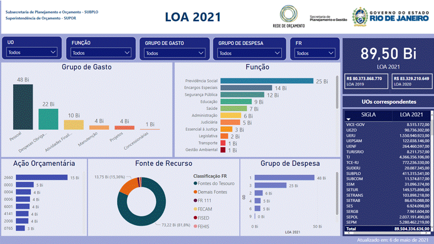
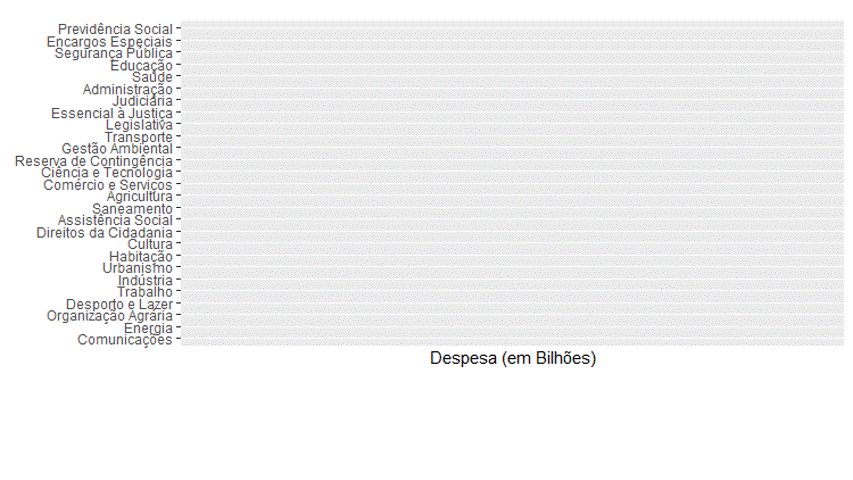

<style>                     
.navbar {
  background-color:#56B4E9;
  border-color:white;
}
.navbar-brand {
color:white!important;
}

body {
    font-family: "Raleway","Helvetica Neue",Helvetica,Arial,sans-serif;
    font-size: 14px;
    line-height: 1.42857;
    color: rgb(31, 31, 31);
    background-color: rgb(255, 255, 255);
}

</style>   


```{r setup, include=FALSE}
library(flexdashboard)
library(tidyverse)
library(plotly)
devtools::install_github("hrbrmstr/streamgraph", dep=FALSE)
library(streamgraph)


# Dados
desp_df <- read.csv2("despesa.csv")
rec_df <- read.csv2("receita.csv")
gg_df <- read.csv2("GG.csv")
ggl1_df <- read.csv2("GG-L1-outros.csv")
gd_df <- read.csv2("GD.csv")
func_df <- read.csv2("Funcoes.csv")

# Prepara Despesa
desp_df2 <-as_tibble(desp_df)
desp_df2 <- desp_df2 %>%
  pivot_longer(-Exercicio,
               names_to = "Tipo",
               values_to = "Valor")

# Prepara Receita
rec_df2 <-as_tibble(rec_df)
rec_df2 <- rec_df2 %>%
  pivot_longer(-Exercicio,
               names_to = "Tipo",
               values_to = "Valor")

# Prepara Grupos de Gasto
gg_df2 <-as_tibble(gg_df)
gg_df2 <- gg_df2 %>%
  select(c(Exercicio, GG, Dotacao_Inicial))

# Prepara L1 x Outros GG
ggl1_df2 <-as_tibble(ggl1_df)
ggl1_df2 <- ggl1_df2 %>%
  select(c(Exercicio, GG, Rel_L1xOutros))
ggl1_df2$Rel_L1xOutros <- round(ggl1_df2$Rel_L1xOutros,2)

# Prepara Grupos de Despesa
gd_df2 <-as_tibble(gd_df)
gd_df2 <- gd_df2 %>%
  select(c(Exercicio, GD, Dotacao_Inicial))
gd_df2$GD <- as.factor(gd_df2$GD)
#gd_df2$Dot_Inicial <- as.numeric(gd_df2$Dot_Inicial)
head(gd_df2)


```


# Proposta {data-icon="fa-database"}

Column {data-width=150}
--------------------------------------------------------------

### Bases de Dados
```{r}
db <- 6
valueBox(db, icon="fa-database", color = "primary")
```

---------
### Linhas de Código
```{r}
t <- 708
valueBox(t, icon="fa-pencil", color = "secondary")
```

---------
### Registros
```{r}
r <- 391705
valueBox(r, icon="fa-server", color = "primary")
```

---------
### Evolução da 1ª fase
```{r}
c <- 90
gauge(c, min= 0, max = 100, gaugeSectors(success = c(76,100), warning = c(36, 75), danger = c(0,35)))
```


Column {data-width=600}
-----------------------------------------------------------------------
### Apresentação

Os gráficos apresentados aqui são uma exploração de bases de dados extraídas do SIAFEM e do SIAFE-Rio com execução orçamentária e financeira do Estado do Rio de Janeiro de 1999 a 2020.

O objetivo da primeira fase é gerar gráficos com as séries históricas de:

- Receita

- Despesa

- Grupos de Gasto

- Grupos de Despesa e

- Funções. 

Essas escolhas partem do Painel SUPOR (ao lado).

Numa segunda fase espera-se integrar bases de dados do IBGE e bases com a execução orçamentária da União e do Estado São Paulo. À medida que as bases sejam depuradas e harmonizadas será possível ampliar o número de visualizações e será possível aprofundar as análises.


Column {data-width=250}
-----------------------------------------------------------------------
### Painel SUPOR



### Fontes: 
Receita e Despesa: Extrações SIG(SIAFEM) e Flexvision(SIAFE)

PIB-RJ: IBGE


Agradecimentos especiais ao Marcão pelas bases e pelas dicas.


# Receita e Despesa {data-icon="fa-line-chart" data-navmenu="Gráficos"}
Column {data-width=850}
-----------------------------------------------------------------------

### Receita Inicial e Receita Realizada 

```{r}
renderPlotly(
ggplot(rec_df2, aes(x=Exercicio, y=Valor, group=Tipo)) +
  geom_line(aes(color=Tipo, linetype=Tipo))+
  #  geom_point(aes(color=Tipo))+
  scale_color_brewer(palette="Dark2")+
  labs(#title = "Receita Inicial e Receita Realizada",
       caption = "Fontes: SIAFEM, SIAFE e IBGE",
       x = "Exercicios (1999 a 2020)",
       y = "Receita (em Bilhões)",
       colour = "Tipo")+
  theme(legend.position="bottom")+
  scale_linetype_manual(values=c("dotted", "dotted", "solid", "solid"))+
  scale_y_continuous(
    breaks = seq(0, 110, 20),
    minor_breaks = NULL
  )
)
```

### Despesa - Dotação Inicial e Despesa Liquidada 

```{r}
renderPlotly(
  ggplot(desp_df2, aes(x=Exercicio, y=Valor, group=Tipo)) +
  geom_line(aes(color=Tipo, linetype=Tipo))+
#  geom_point(aes(color=Tipo))+
  scale_color_brewer(palette="Dark2")+
  labs(#title = "Dotação Inicial e Despesa Liquidada",
        caption = "Fontes: SIAFEM e SIAFE",
        x = "Exercicios (1999 a 2020)",
        y = "Despesa (em Bilhões)",
        colour = "Tipo")+
  theme(legend.position="bottom")+
  scale_linetype_manual(values=c("solid", "solid","dotted"))+
  scale_y_continuous(
    breaks = seq(0, 110, 20),
    minor_breaks = NULL
  )
)

```

Column {data-width=150}
-----------------------------------------------------------------------
### Fontes:
Receita e Despesa: Extrações SIG(SIAFEM) e Flexvision(SIAFE)

PIB-RJ: IBGE


Agradecimentos especiais ao Marcão pelas bases e pelas dicas.

### Esclarecimentos:
Receita e Despesa: Os valores são apresentados em bilhões de reais (/1.000.000.000)

PIB-RJ: Os valores foram normalizados ficar na mesma escala (/10.000.000) e permitir a comparação do comportamento. Sendo assim, não representam o PIB real.

Os percentuais de realização são calculados realizado/inicial e liquidado/inicial, respectivamente. Os valores também foram normalizados para ficar na mesma escala. 

# Grupos de Gasto  {data-icon="fa-bar-chart" data-navmenu="Gráficos"}
Column {data-width=650}
-----------------------------------------------------------------------

### Grupos de Gasto (Dotação Inicial por Exercicio)


```{r}
renderPlotly(
# Plota Grupos de Gasto
ggplot(gg_df2, aes(x=Exercicio, y=Dotacao_Inicial, group=GG)) +
  geom_line(aes(color=GG, linetype=GG))+
#  geom_point(aes(color=GG))+
  scale_color_brewer(palette="Dark2")+
  labs(#title = "GG por Dotação Inicial",
       x = "Exercicios (1999 a 2020)",
       y = "Despesa (em Bilhões)",
       colour = "GG")+
  theme(legend.position="bottom")
)
```

Column {data-width=350}
-----------------------------------------------------------------------
### Proporção do GG-L1 e dos demais em relação à Despesa Total


```{r}
renderPlotly(
ggplot(ggl1_df2, aes(x=Exercicio, y=Rel_L1xOutros, group=GG)) +
    geom_line(aes(color=GG, linetype=GG))+
#    geom_point(aes(color=GG))+
    scale_color_brewer(palette="Dark2")+
    labs(#title = "GG-L1 x Outros GG",
         x = "Exercicios (2001 a 2020)",
         y = "Percentual",
         colour = "GG")+
    theme(legend.position="bottom")
)

```

# Grupos de Despesa  {data-icon="fa-area-chart" data-navmenu="Gráficos"}
Column {data-width=650}
-----------------------------------------------------------------------


### Grupos de Despesa (Dotação Inicial por Exercicio)


```{r}
renderPlotly(
# Plota Grupos de Despesa
ggplot(gd_df2, aes(x=Exercicio, y=Dotacao_Inicial, group=GD)) +
  geom_line(aes(color=GD, linetype=GD))+
#  geom_point(aes(color=GD))+
  scale_color_brewer(palette="Dark2")+
  labs(#title = "GD por Dotação Inicial",
    x = "Exercicios (1999 a 2020)",
    y = "Despesa (em Bilhões)",
    colour = "GD")+
  theme(legend.position="bottom") +
  scale_y_continuous(
    breaks = seq(0, 100, 10),
    minor_breaks = NULL)
)

```


### Grupos de Despesa (streamgraph)

```{r}
# Create data:
dataGD <- data.frame(
  year=gd_df2$Exercicio,
  name=gd_df2$GD,
  value=gd_df2$Dotacao_Inicial
)
cores <- c("#1B9E77", "#D95F02", "#7570B3", "#E7298A", "#66A61E", "#E6AB02", "#A6761D", "gray40", "black")

# Stream graph with a legend
GDstream <- streamgraph(dataGD, key="name", 
                  value="value", offset = "expand", date="year",
                  height="200px", width="800px"
                  ) %>%
  sg_axis_x(2, "year", "%Y") %>%
  sg_fill_tableau(cores) %>%
  sg_legend(show=TRUE, label="Grupo de Despesa: ")

GDstream

```


# Funções  {data-icon="fa-sort-amount-desc" data-navmenu="Gráficos"}
Column {data-width=550}
-----------------------------------------------------------------------

### Funções por Dotação Inicial (de 2000 a 2020) - RASCUNHO




Column {data-width=450}
-----------------------------------------------------------------------
### Funções de 2000 a 2020 (Despesa em Bilhões) - streamgraph 


```{r}
# Plota streamgraph Funções

# Create data:
dataFunc <- data.frame(
  year=func_df$Exercicio,
  name=func_df$TitFunc,
  value=func_df$Dotacao_Inicial
)
cores <- c("#1B9E77", "#D95F02", "#7570B3", "#E7298A", "#66A61E", "#E6AB02", "#A6761D", "gray40", "black")

# Stream graph with a legend
FuncStream <- streamgraph(dataFunc, key="name", 
                        value="value", offset = "expand", date="year",
                        height="200px", width="800px") %>%
  sg_axis_x(2, "year", "%Y") %>%
  sg_fill_tableau(cores) %>%
  sg_legend(show=TRUE, label="Função: ")

FuncStream

```


# Referências {data-icon="fa-book"}
Column {data-width=500}
-----------------------------------------------------------------------

### Esclarecimentos:
Receita e Despesa: Os valores são apresentados em bilhões de reais (/1.000.000.000)

PIB-RJ: Os valores foram normalizados ficar na mesma escala (/10.000.000) e permitir a comparação do comportamento. Sendo assim, não representam o PIB real.

Os percentuais de realização são calculados realizado/inicial e liquidado/inicial, respectivamente. Os valores também foram normalizados para ficar na mesma escala. 
```{r}

```

### Fontes:
Receita e Despesa: Extrações SIG(SIAFEM) e Flexvision(SIAFE). Agradecimentos especiais ao Marcão pelas bases e pelas dicas.


<a href="https://app.powerbi.com/view?r=eyJrIjoiZGZjYjZiM2UtOTJkYS00MWE4LTk0OTMtMGU2NTYzYmY2MWRhIiwidCI6ImRjYzllZTExLWQ1MTgtNDNmMS04YjNkLTEzYWE0NzBlMWNlZCJ9&pageName=ReportSection">Painel SUPOR</a>

PIB-RJ: <a href="https://www.ibge.gov.br/estatisticas/economicas/contas-nacionais/9088-produto-interno-bruto-dos-municipios.html?=&t=series-historicas&utm_source=landing&utm_medium=explica&utm_campaign=pib" >IBGE-PIB dos Municípios</a>

Receita e Despesa de São Paulo: SIAFEM-SP - <a href="https://www.fazenda.sp.gov.br/SigeoLei131/Paginas/ConsultaDespesaAno.aspx?orgao=" >Despesa Inicial x Despesa Liquidada</a> e <a href="https://www.fazenda.sp.gov.br/SigeoLei131/Paginas/FlexConsDespesa.aspx">Execução Orçamentária e Financeira - Despesa</a>

Column {data-width=500}
-----------------------------------------------------------------------
### Material didático

Em português:

-- <a href="https://www.youtube.com/watch?v=51N-LSYXlHU">Dashboard Básico em R</a> - vídeo

-- <a href="https://www.youtube.com/watch?v=hgqpbkJFP-g">Dashboard Avançado em R</a> - Quase todos os recursos utilizados neste dashboard vem desse vídeo da Ana Carolina Dias. 

-- Workshop sobre o livro _Storytelling com Dados_" - também com a Ana Carolina Dias: 
<a href="https://www.youtube.com/watch?v=gEsWb4_pcA0">Parte 1</a>, 
<a href="https://www.youtube.com/watch?v=ApXbhBbZsp4">Parte 2</a>,
<a href="https://www.youtube.com/watch?v=_yN8SacwKlw">Parte 3</a> e
<a href="https://www.youtube.com/watch?v=crkoUp8HA6c">Parte 4</a>.


Em inglês:

-- <a href="https://www.datacamp.com/tracks/data-scientist-with-r">Datacamp - Data Scientist with R</a> - pago

-- <a href="https://r4ds.had.co.nz/index.html">R for Data Science</a> - gratuito - curso elaborado pelo criador do Tidyverse.

-- <a href="https://www.tidyverse.org/">Tidyverse</a>  - site oficial com muitos tutoriais.


